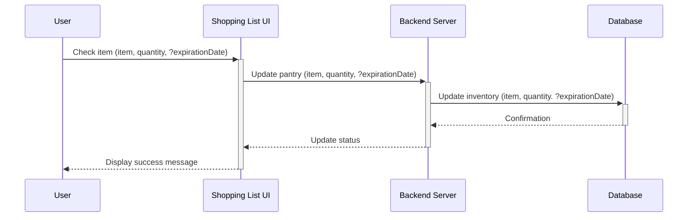

# PantryManager

An application that manages your pantry inventory, hosts your recipes, and manages your shopping list. All in one.

This app will first have you inventory your pantry, including how much of something you have. It will use conversions as needed. Then you enter your recipes, and it will automatically make shopping lists for each recipe, based on what you do and don't have in your pantry. There will be notifications to review/update your inventory, defaults to every Sunday.

Stretch goals:

- use inventory discover new recipes
- Analytics
  - Ingredient use over time
  - Price of ingredients over time
  - (?) Price Book: track prices over time at multiple supermarkets
- integration with Flipp
- integration with Instacart
- integration with Notion/Obsidian/Logseq/Zettlr
- Integration with Todoist/TickTick
- Nextcloud integration

Up for debate: whether to use AI to generate recipes based on the pantry.

When you make a recipe, mark it as Complete and the app will automatically deduct the amounts from your inventory.

---

When you fill out your shopping list, this will update your inventory. Current planned implementation looks like this:

